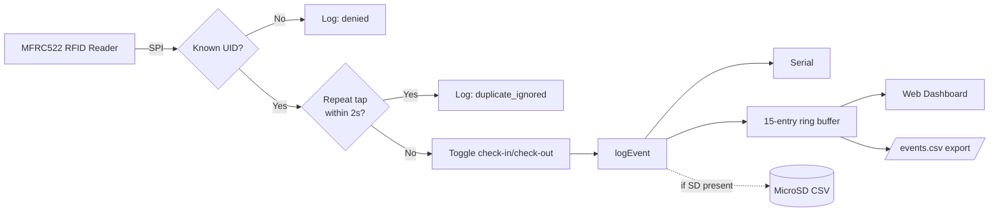
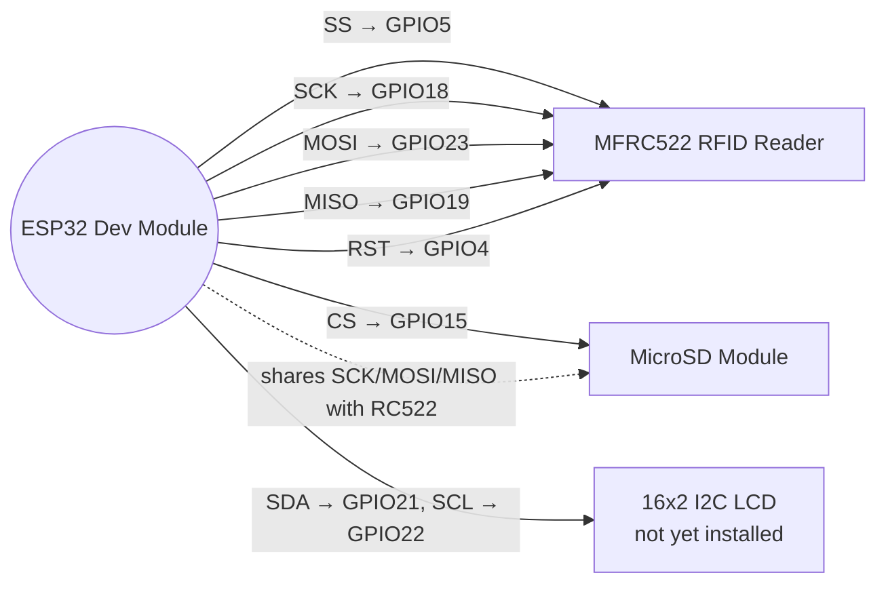
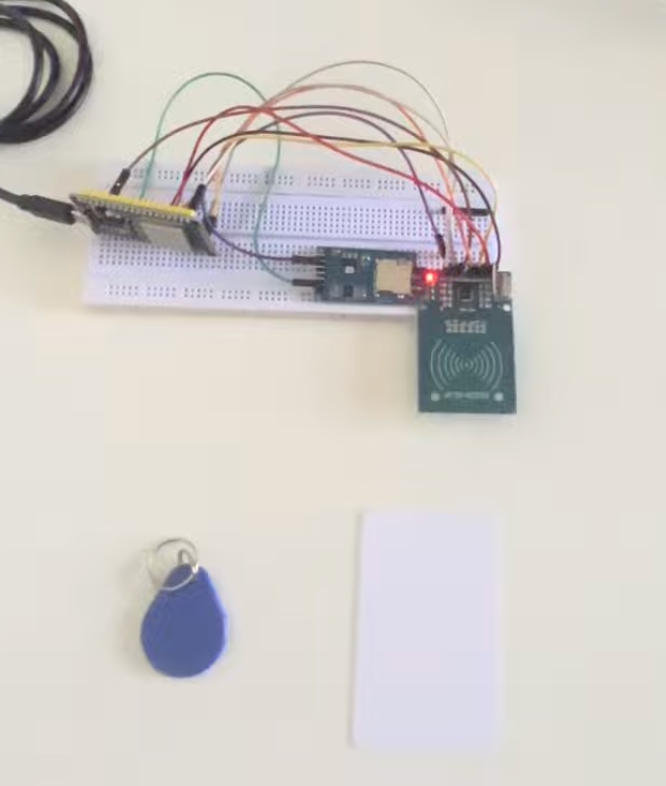

# RFID Event Logger

[](https://github.com/rudrarajumc-star/rfid-event-logger/actions/workflows/compile-check.yml)

An ESP32-based RFID check-in/check-out attendance logger with a live web
dashboard, CSV export, and WiFi/NTP timestamps — built around a
graceful-degradation design where any optional subsystem can fail without
stopping the core scan-and-log pipeline.

The badge above means what it says and nothing more: the code compiles
cleanly for the ESP32 toolchain in both SPS and LAI mode, checked on
every push. It is not a claim that anything is hardware-verified — the
status table below and `docs/evidence/lai/` carry that weight
separately, with actual captured logs, not a green checkmark.

**[Watch the demo](https://youtu.be/MSz-1_x-4so)** · Full debugging
history: [`docs/DEVELOPMENT_LOG.md`](./docs/DEVELOPMENT_LOG.md)

### Configurable for more than one organization

As of `v2.1.0-student-subject`, one firmware supports two independent
deployment contexts through a single config choice — SPS workforce
attendance (documented on this page) and LAI tutor attendance /
volunteer-hour verification (including optional anonymous student
check-in with subject selection — no names, ever). See
[`docs/LAI_MODE.md`](./docs/LAI_MODE.md) for that
mode specifically — **engineering-complete and tested with synthetic
data, not yet piloted with a real organization**; see
[`docs/PILOT_PROTOCOL.md`](./docs/PILOT_PROTOCOL.md) for what that would
require and [`docs/PRIVACY.md`](./docs/PRIVACY.md) for the privacy
constraints either mode needs before real use.

## Status

Distinguishes **Verified** (watched working on real hardware) from
**Pending** (implemented, not yet demonstrated). Nothing here is claimed
as working unless it was actually observed working.

| Feature | Status |
|---|---|
| RFID known/unknown card detection | **Verified** |
| Check-in / check-out toggle with duration | **Verified** |
| WiFi connect + NTP time sync | **Verified** |
| Web dashboard + CSV export | **Verified** |
| Fail-safe (WiFi/SD/LCD optional) | **Verified** |
| Duplicate-scan suppression (2s window) | **Verified** |
| Short-session anomaly flag (2–5s window) | **Verified** — re-tested with millisecond diagnostics, see note below |
| Dashboard overview stats | **Verified** |
| MicroSD card logging | **Pending** — wired, not yet verified writing |
| Physical LCD output | **Pending** — hardware not yet installed |
| Backend / database / multi-device sync | **Not built** — out of scope for this prototype |

> **Resolved:** an earlier version of this README had a short-session
> example with timestamps only 1 second apart, which is mathematically
> impossible to distinguish from the 2-second duplicate window given
> 1-second log resolution — a real inconsistency, not just a typo. The
> firmware was instrumented with a `millis()`-based debug print and
> re-tested; the corrected, unambiguous evidence is below. See
> `docs/DEVELOPMENT_LOG.md` for the full explanation and the original
> catch.

## Architecture



## Wiring



Full pin tables (voltages, grounds, and the shared-SPI-bus note that
caused a real bug — see dev log):

<details>
<summary>RC522 → ESP32</summary>

| RC522 pin | ESP32 pin |
|---|---|
| SDA (SS) | GPIO5 |
| SCK | GPIO18 |
| MOSI | GPIO23 |
| MISO | GPIO19 |
| RST | GPIO4 |
| 3.3V | 3.3V (not 5V — RC522 is 3.3V only) |
| GND | GND |
</details>

<details>
<summary>MicroSD module → ESP32 (shares SPI bus with RC522)</summary>

| SD pin | ESP32 pin |
|---|---|
| CS | GPIO15 |
| SCK / MOSI / MISO | GPIO18 / 23 / 19 (shared) |
| VCC | 3.3V or 5V — check your module |
| GND | GND |
</details>

<details>
<summary>16x2 I2C LCD → ESP32 (not yet installed)</summary>

| LCD pin | ESP32 pin |
|---|---|
| SDA | GPIO21 |
| SCL | GPIO22 |
| VCC | 5V (check your backpack) |
| GND | GND |
</details>

## Setup

The firmware lives in [`firmware/rfid_event_logger/`](./firmware/rfid_event_logger/)
— that subfolder name has to match the `.ino` filename exactly, or
Arduino IDE and `arduino-cli` won't recognize it as a valid sketch.
Don't rename or move `rfid_event_logger.ino` out of its folder.

1. Install Arduino IDE 2.x + ESP32 board package, plus `MFRC522`,
   `LiquidCrystal_I2C`, `SD`, and `WebServer` (last two ship with the
   ESP32 board package).
2. Wire per the diagram above.
3. **Create your private config files — the sketch will not compile
   without them:**
   ```bash
   cd firmware/rfid_event_logger/config
   cp organization.example.h organization.h
   cp users.example.h users_private.h
   ```
   Both are gitignored. Edit `organization.h` to pick `SPS_MODE` or
   `LAI_MODE`, and `users_private.h` to register real cards (see step
   6). Full details in [`docs/LAI_MODE.md`](./docs/LAI_MODE.md) if
   you're setting up LAI mode specifically.
4. Open `firmware/rfid_event_logger/rfid_event_logger.ino` in Arduino
   IDE (opening the `.ino` directly is fine — just don't let the IDE
   move it to a differently-named folder if it ever offers to), select
   **ESP32 Dev Module**.
5. Fill in `WIFI_SSID` / `WIFI_PASSWORD` **locally only** — see security
   note below, never commit real credentials.
6. Upload, open Serial Monitor at 115200 baud.
7. Tap an unregistered card — its UID prints to Serial. Copy it into a
   new row in `firmware/rfid_event_logger/config/users_private.h` with
   an anonymous code and alias (e.g. `TUTOR-004`, `CARD-T4`), set
   `active = true`, re-upload.
8. Once WiFi connects, visit the printed dashboard URL in a browser on
   the same network.

### Security note

`WIFI_SSID` / `WIFI_PASSWORD` **must** stay as empty strings (`""`) in
anything committed here. Fill them in locally only, never in a commit,
issue, or chat client. For a cleaner multi-device setup, use a
gitignored `secrets.h`:

```cpp
// secrets.h — add to .gitignore, never commit
#define WIFI_SSID "your-network-name"
#define WIFI_PASSWORD "your-network-password"
```

## Evidence

Full logs, the dashboard walkthrough, and the duplicate/anomaly tests are
in the [demo video](https://youtu.be/MSz-1_x-4so).

> **Schema note:** the log lines below were captured on `v1.4`, which
> used an 8-field CSV schema. The current firmware (`v2.0.0-dual-mode`)
> logs 14 fields per event (adds `event_id`, `organization`, `site_code`,
> `program_code`, `card_alias`, `session_id`, `device_id`,
> `firmware_version` — see `docs/LAI_MODE.md` for the full schema). The
> duplicate-suppression and short-session logic these lines demonstrate
> is unchanged between the two versions; only the number of columns
> grew. If you diff these lines against a fresh export from current
> firmware, the field count mismatch is expected, not a bug.

**Duplicate suppression** — unaffected by the timestamp-resolution issue
above since a 1s-apart pair is always <2000ms:

```
2026-08-11 17:50:42,SPS,employee,TEST-001,CARD-A,check-in,,success
2026-08-11 17:50:43,SPS,employee,TEST-001,CARD-A,scan,,duplicate_ignored
2026-08-11 17:50:53,SPS,employee,TEST-001,CARD-A,check-out,0,success
```

**Short-session flag, corrected test** — re-run with a `millis()`-based
debug print added right before the flag decision, giving exact
millisecond precision instead of the 1-second-resolution display
timestamp. The debug line proves the true gap was 2060ms: above the
2000ms duplicate-suppression cutoff (so it wasn't swallowed as a
duplicate) and below the 5000ms short-session threshold (so it correctly
got flagged) — mathematically unambiguous:

```
2026-08-11 18:54:26,SPS,employee,TEST-001,CARD-A,check-in,,success
[DEBUG] elapsedMs since check-in: 2060
2026-08-11 18:54:28,SPS,employee,TEST-001,CARD-A,check-out,0,flagged_short_session
```

## Screenshots




A Serial Monitor screenshot is still outstanding — the two above are the
actual wired board and the live dashboard, not mockups.

## Known limitations

- SD/LCD status pills were removed from the dashboard rather than left
  showing `OFF` for unverified subsystems — see dev log.
- MicroSD logging and physical LCD output are implemented with tested
  graceful-degradation paths but not yet verified on hardware.
- No dashboard/CSV authentication — suitable only for a controlled
  demonstration; authentication is required before processing real
  attendance data.
- Duplicate/anomaly thresholds (2s/5s) are tunable `const`s, not
  guarantees — a legitimately fast visit could still get flagged.
- This is a single-device prototype: no backend, database, or
  multi-device sync. See `docs/DEVELOPMENT_LOG.md` for the full history
  and `PUBLISH_CHECKLIST.md` for what's still open.
- Card IDs and user codes in this README/dev log are anonymized
  (`CARD-A`/`TEST-001`, not the real values). Note for transparency: the
  first published commit predates this anonymization pass, so the
  original values are still recoverable from git history. This isn't a
  security-sensitive leak — an RFID UID isn't a secret, it's a public
  identifier readable by any nearby reader — but it's disclosed here
  rather than silently glossed over.
- LAI mode is engineering-complete and hardware-tested with synthetic
  data only — it has not been piloted with a real organization, real
  tutors, or real cards. See `docs/LAI_MODE.md`, `docs/PILOT_PROTOCOL.md`,
  and `docs/PRIVACY.md` before treating it as anything more than that.

## License

MIT — see [`LICENSE`](./LICENSE).
