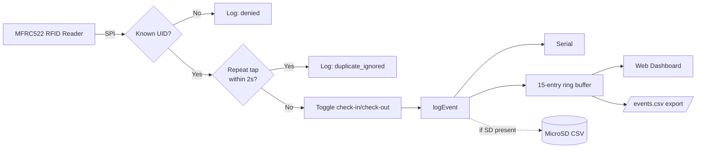
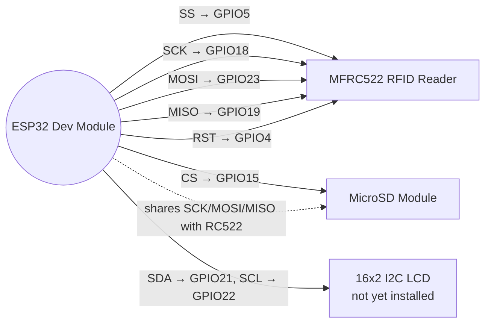
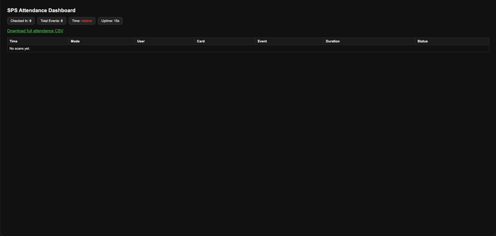

# RFID Event Logger

An ESP32-based RFID check-in/check-out attendance logger with a live web
dashboard, CSV export, and WiFi/NTP timestamps — built around a
graceful-degradation design where any optional subsystem can fail without
stopping the core scan-and-log pipeline.

**[Watch the demo](https://youtu.be/MSz-1_x-4so)** · Full debugging
history: [`docs/DEVELOPMENT_LOG.md`](./docs/DEVELOPMENT_LOG.md)

## Status

Distinguishes **Verified** (watched working on real hardware) from
**Pending** (implemented, not yet demonstrated). Nothing here is claimed
as working unless it was actually observed working.

| Feature | Status |
|---|---|
| RFID known/unknown card detection | **Verified** |
| Check-in / check-out toggle with duration | **Verified** |
| WiFi connect + NTP time sync | **Verified** |
| Web dashboard + CSV export | **Verified** |
| Fail-safe (WiFi/SD/LCD optional) | **Verified** |
| Duplicate-scan suppression (2s window) | **Verified** |
| Short-session anomaly flag (2–5s window) | **Verify again** — see note below |
| Dashboard overview stats | **Verified** |
| MicroSD card logging | **Pending** — wired, not yet verified writing |
| Physical LCD output | **Pending** — hardware not yet installed |
| Backend / database / multi-device sync | **Not built** — out of scope for this prototype |

> **Open issue:** the short-session example previously in this README had
> timestamps only 1 second apart, which is mathematically impossible to
> distinguish from the 2-second duplicate window given 1-second log
> resolution — a real inconsistency, not just a typo. It's been pulled
> pending a re-test with a wider, unambiguous gap (3s+). See
> `docs/DEVELOPMENT_LOG.md` for the full explanation.

## Architecture



## Wiring



Full pin tables (voltages, grounds, and the shared-SPI-bus note that
caused a real bug — see dev log):

<details>
<summary>RC522 → ESP32</summary>

| RC522 pin | ESP32 pin |
|---|---|
| SDA (SS) | GPIO5 |
| SCK | GPIO18 |
| MOSI | GPIO23 |
| MISO | GPIO19 |
| RST | GPIO4 |
| 3.3V | 3.3V (not 5V — RC522 is 3.3V only) |
| GND | GND |
</details>

<details>
<summary>MicroSD module → ESP32 (shares SPI bus with RC522)</summary>

| SD pin | ESP32 pin |
|---|---|
| CS | GPIO15 |
| SCK / MOSI / MISO | GPIO18 / 23 / 19 (shared) |
| VCC | 3.3V or 5V — check your module |
| GND | GND |
</details>

<details>
<summary>16x2 I2C LCD → ESP32 (not yet installed)</summary>

| LCD pin | ESP32 pin |
|---|---|
| SDA | GPIO21 |
| SCL | GPIO22 |
| VCC | 5V (check your backpack) |
| GND | GND |
</details>

## Setup

1. Install Arduino IDE 2.x + ESP32 board package, plus `MFRC522`,
   `LiquidCrystal_I2C`, `SD`, and `WebServer` (last two ship with the
   ESP32 board package).
2. Wire per the diagram above.
3. Open `rfid_event_logger.ino`, select **ESP32 Dev Module**.
4. Fill in `WIFI_SSID` / `WIFI_PASSWORD` **locally only** — see security
   note below, never commit real credentials.
5. Upload, open Serial Monitor at 115200 baud.
6. Tap an unregistered card — its UID prints to Serial. Add it to
   `knownUsers[]` to register it.
7. Once WiFi connects, visit the printed dashboard URL in a browser on
   the same network.

### Security note

`WIFI_SSID` / `WIFI_PASSWORD` **must** stay as empty strings (`""`) in
anything committed here. Fill them in locally only, never in a commit,
issue, or chat client. For a cleaner multi-device setup, use a
gitignored `secrets.h`:

```cpp
// secrets.h — add to .gitignore, never commit
#define WIFI_SSID "your-network-name"
#define WIFI_PASSWORD "your-network-password"
```

## Evidence

Full logs, the dashboard walkthrough, and the duplicate/anomaly tests are
in the [demo video](https://youtu.be/MSz-1_x-4so). One representative
Serial excerpt (duplicate suppression, unaffected by the timestamp-resolution
issue above since a 1s-apart pair is always <2000ms):

```
2026-08-11 17:50:42,SPS,employee,SPS-001,21130407,check-in,,success
2026-08-11 17:50:43,SPS,employee,SPS-001,21130407,scan,,duplicate_ignored
2026-08-11 17:50:53,SPS,employee,SPS-001,21130407,check-out,0,success
```

## Screenshots

Add 2-3 screenshots (dashboard, Serial Monitor, wired breadboard) to
`docs/screenshots/` and reference them:

```md

```

## Known limitations

- SD/LCD status pills were removed from the dashboard rather than left
  showing `OFF` for unverified subsystems — see dev log.
- MicroSD logging and physical LCD output are implemented with tested
  graceful-degradation paths but not yet verified on hardware.
- No dashboard/CSV authentication — fine for a private-network prototype.
- Duplicate/anomaly thresholds (2s/5s) are tunable `const`s, not
  guarantees — a legitimately fast visit could still get flagged.
- This is a single-device prototype: no backend, database, or
  multi-device sync. See `docs/DEVELOPMENT_LOG.md` for the full history
  and `PUBLISH_CHECKLIST.md` for what's still open.

## License

MIT — see [`LICENSE`](./LICENSE).
